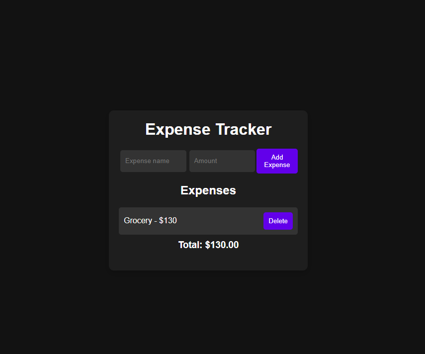

# JavaScript Expense Tracker

This project is a dynamic client-side expense tracker application, built using vanilla JavaScript, HTML, and CSS. It provides users with a straightforward way to manage their personal finances by tracking income and expenses, viewing transaction history, and maintaining an updated balance. This application highlights effective use of DOM manipulation and local data management.

## Screenshot

## Features

- **Add Transactions:** Easily input new income or expense records with descriptions and amounts.
- **Live Balance Update:** The total balance updates in real-time as transactions are added or removed.
- **Transaction History:** View a clear list of all past transactions, categorized as income or expense.
- **Delete Transactions:** Option to remove individual transactions from the history.
- **Responsive Design:** The interface is designed to be user-friendly and visually appealing across various device sizes.

## Tech Stack

- **JavaScript (Vanilla):** Manages all application logic, including adding/deleting transactions, updating the balance, and dynamically manipulating the DOM.
- **HTML5:** Provides the semantic structure for the input forms, transaction list, and balance display.
- **CSS3:** Handles all custom styling, layout, and responsive design, ensuring a clean and intuitive user interface.

## Contributing

Contributions are what make the open-source community such an amazing place to learn, inspire, and create. Any contributions you make are **greatly appreciated**.

If you have a suggestion that would make this better, please fork the repo and create a pull request. You can also simply open an issue with the tag "enhancement". Don't forget to give the project a star! Thanks again!

1.  Fork the Project
2.  Create your Feature Branch (`git checkout -b feature/AmazingFeature`)
3.  Commit your Changes (`git commit -m 'Add some AmazingFeature'`)
4.  Push to the Branch (`git push origin feature/AmazingFeature`)
5.  Open a Pull Request
